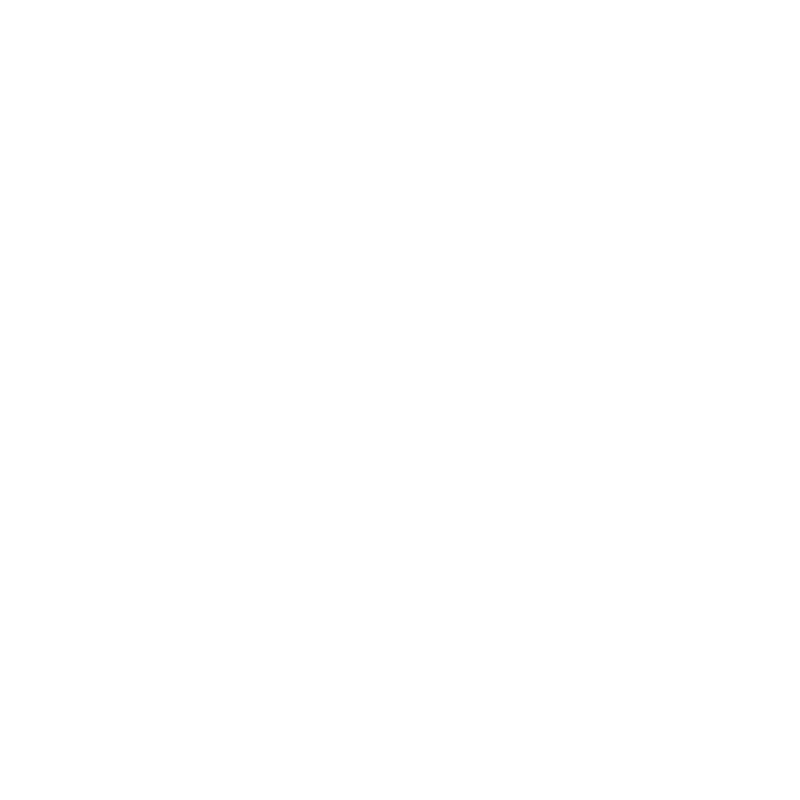

# 🎮 Unseen Snick

**`Digital Craftsman (Aspiring Developer)`**

Hello! As an aspiring Full Stack Developer, my curiosity drives me to learn and innovate. Currently, I'm deeply engaged with Python and Django, working on numerous practical projects. While Java and Python serve as my foundational coding languages, my primary focus is Python. I'm already eyeing my next learning targets - JavaScript, TypeScript, and React. I am constantly excited to acquire new languages and frameworks, committed to refining my skills in this evolving digital age.

---

### 🧰 Languages and Tools

 

#

### 🌱 Learning Languages and Tools

 

#

### 💾 Databases

 

#

 
<h3>👨‍💻 Unseen Snick's Coding Journey</h3>

My coding journey began in January 2022 with a game design course, SPD and MAPP a mobile app design course. This experience taught me the basics of coding in C# and Unity. During this course, I made several games, including a platformer, a tic-tac-toe game, and a top-down shooter mobile game. While the process was both challenging and enjoyable, I found myself drawn more to the coding and testing aspects rather than the planning phases like drafting game design documents and level map designs.
  
In an effort to delve further into the world of coding, I signed up for courses in both Java and Python provided by KIT (Kunnskapstrening IT). Originally, the Java course was a program from Stockholm University, while the Python course was a new addition to KIT's offerings. The Python course had limited material, and although we did use resources like the 'Scientific Computing with Python' course from freeCodeCamp, material found on youtube and other free courses online, I found translating the Java course into Python was what truly bolstered my understanding. This experience took place around August/September 2022, giving me a robust foundation in both languages.
  
Being an independent learner, I utilized my spare time to dive into GUI programming. This led me to create several Java and Python programs, utilizing tools such as PyQt5/6 and SceneBuilder.
  
After finishing the Java and Python courses, my natural curiosity nudged me towards exploring other languages and frameworks. I've been engaged in various projects, both during and after these courses. While I'm still in the initial phases of getting the hang of these new technologies, I'm eagerly looking forward to the journey and growth that await me.

<!--
**unseensnick/unseensnick** is a ✨ _special_ ✨ repository because its `README.md` (this file) appears on your GitHub profile.

Here are some ideas to get you started:

- 🔭 I’m currently working on ...
- 🌱 I’m currently learning ...
- 👯 I’m looking to collaborate on ...
- 🤔 I’m looking for help with ...
- 💬 Ask me about ...
- 📫 How to reach me: ...
- 😄 Pronouns: ...
- ⚡ Fun fact: ...
-->
